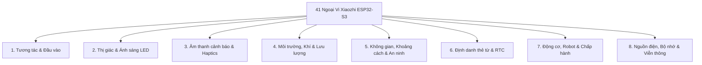

# 🤖 Xiaozhi AI Chatbot — Custom Hardware & Zero-Code Builder

<p align="center">
  
  
  
  
  
  
</p>

> 🚀 **Bộ công cụ hiện thực hóa Chatbot AI Xiaozhi cho mọi Maker — Dễ như ghép Lego, tùy biến linh kiện bằng một cú click, cắm là chạy mà không cần viết code!**

---

## 📑 Mục Lục Nhanh
1. [Giới Thiệu Dự Án](#-giới-thiệu-dự-án)
2. [Điểm Nổi Bật & Khác Biệt](#-điểm-nổi-bật--tính-năng-vượt-trội)
3. [Danh Sách 41 Ngoại Vi Theo 8 Nhóm](#-danh-sách-41-ngoại-vi-chuẩn-hóa-theo-8-nhóm-chức-năng)
4. [Hệ Sinh Thái Màn Hình & Âm Thanh](#-hỗ-trợ-đa-dạng-màn-hình--âm-thanh-hi-fi)
5. [Hướng Dẫn Bắt Đầu Nhanh (Quick Start)](#-hướng-dẫn-nhanh-cho-người-dùng-mới-quick-start)
6. [Hướng Dẫn Cấu Hình System Prompt Cho AI](#-hướng-dẫn-cấu-hình-system-prompt-cho-ai-gọi-đúng-công-cụ-mcp)
7. [Quy Trình Làm Việc & Bảo Vệ Mã Nguồn](#-quy-trình-làm-việc--an-toàn-mã-nguồn-safety-workflow)
8. [Tài Liệu Kỹ Thuật Chi Tiết](#-tài-liệu-kỹ-thuật-chi-tiết)
9. [Đóng Góp & Giấy Phép](#-đóng-góp--giấy-phép)

---

## 🌟 Giới Thiệu Dự Án

**Xiaozhi (小智 AI)** là nền tảng trợ lý giọng nói thông minh nguồn mở chạy trên vi điều khiển ESP32, tích hợp các mô hình ngôn ngữ lớn (LLM như Qwen, DeepSeek, ChatGPT), nhận dạng giọng nói (ASR), tổng hợp âm thanh (TTS) và giao thức điều khiển thiết bị ngoại vi thời gian thực (**MCP - Model Context Protocol**).

Dự án **Xiaozhi Custom Builder** được phát triển nhằm **xóa bỏ hoàn toàn rào cản kỹ thuật lập trình**:
- **Không cần viết code C/C++:** Toàn bộ cấu hình phần cứng, gán chân GPIO, lựa chọn màn hình, bộ giải mã âm thanh hay cảm biến được điều khiển trực quan qua `menuconfig`.
- **An toàn phần cứng 100%:** Tích hợp bộ kiểm định **GPIO Safety Validator** độc quyền, tự động ngăn chặn hoàn toàn việc gán nhầm vào vùng cấm `GPIO 26–37` trên bo mạch ESP32-S3 N16R8 (bảo vệ tuyệt đối 16MB Flash và 8MB Octal PSRAM không bao giờ bị chập cháy hoặc lỗi bộ nhớ).
- **Cơ chế chia sẻ Bus thông minh:** Tối ưu hóa đường truyền I2C và SPI, cho phép hàng chục cảm biến, màn hình cảm ứng, thẻ nhớ và chip mở rộng cùng hoạt động đồng thời mà không xung đột chân.

---

## ⚡ Điểm Nổi Bật & Tính Năng Vượt Trội

| Tiêu chí | Phiên bản Xiaozhi gốc | Phiên bản Xiaozhi Custom Builder |
|:---|:---:|:---:|
| **Tùy biến phần cứng** | Sửa code C++, chỉnh tay từng file header | **Tích chọn checkbox `[*] ` trong `menuconfig`** |
| **Bảo vệ Flash / PSRAM** | Dễ cắm nhầm gây brick chip hoặc crash RAM | **Hard-Gate Validator tự động chặn vùng GPIO 26–37** |
| **Giao diện Menu ngoại vi** | Lồng nhiều cấp phức tạp, khó tìm | **Menu phẳng 41 ngoại vi, chọn là xổ chân, tắt là ẩn** |
| **Bảng tổng hợp phần cứng** | Phải tự nhớ chân nối dây | **Bảng trạng thái trực quan thời gian thực ở đáy menu** |
| **Hệ thống kiểm thử tự động** | Kiểm tra thủ công | **100% Test Suite (93/93 Unit Tests PASS)** |
| **Quản lý mã nguồn sạch** | Dễ làm rác hoặc mất bản gốc | **Cơ chế 2 vùng độc lập (`config/` và `Oginal/`)** |

---

## 🧩 Danh Sách 41 Ngoại Vi Chuẩn Hóa Theo 8 Nhóm Chức Năng

Toàn bộ 41 ngoại vi được tích hợp sẵn sàng trong **Menu 4 (Thiết bị ngoại vi)**. Bạn chỉ cần chọn thiết bị bạn có, menu sẽ tự động xổ ra cấu hình chân GPIO an toàn mặc định:



### 1. Tương Tác & Điều Khiển Đầu Vào (User Inputs)
- **1. Nút nhấn vật lý:** Phím cứng BOOT (GPIO 0) và phím chức năng WAKE (GPIO 47).
- **2. Nút chạm cảm ứng điện dung:** Tận dụng cụm TouchPad nội bộ của ESP32-S3 (GPIO 1–14).
- **3. Công tắc gạt 2 trạng thái:** Slide switch chuyển đổi chế độ hoạt động (GPIO 48).
- **4. Núm xoay vô cấp cơ học (Rotary Encoder EC11):** Xoay chỉnh âm lượng, menu (Pha A: 17, Pha B: 18, Key: 21).
- **5. Cảm biến cử chỉ không chạm 3D & Màu sắc (APDS-9960):** Vẫy tay 4 hướng để điều khiển bot qua I2C.
- **6. Màn hình Cảm ứng điện dung rời (CST816D/S, GT911, FT6236):** Chạm vuốt trực tiếp trên mặt kính LCD (I2C SDA: 8, SCL: 9, INT: 3, RST: 21).

### 2. Thị Giác & Ánh Sáng LED (Lighting & Vision)
- **7. Đèn LED đơn trạng thái:** Báo nguồn, kết nối Wi-Fi, trạng thái lắng nghe (GPIO 38, hỗ trợ PWM LEDC).
- **8. Đèn LED RGB địa chỉ (WS2812B / SK6812 NeoPixel):** Hiệu ứng thở (Breathing), xoay sao băng (Spinning Comet), cầu vồng đổi màu nhanh (Fast Rainbow) khi AI đang nói (GPIO 48).
- **9. IC mở rộng LED đa kênh / Ma trận (AW9523B / IS31FL3731):** 16 kênh LED dòng tĩnh chống sọc camera hoặc ma trận 144 điểm biểu cảm cảm xúc (I2C).
- **10. Camera thu nhận hình ảnh (OV2640 / OV3660 / OV5640 / USB UVC):** Hỗ trợ nhận diện khuôn mặt, phân tích thị giác AI (DVP Parallel 12-pin).

### 3. Âm Thanh Cảnh Báo & Phản Hồi Xúc Giác (Haptics & Audio Feedback)
- **11. Động cơ rung phản hồi xúc giác (Haptic Vibration Motor):** Rung nhẹ khi bot nhận diện câu lệnh hoặc khi chạm nút (GPIO 42).
- **12. Còi báo Buzzer (Active / Passive PWM):** Phát âm bíp thông báo hoặc nhạc chuông khởi động (GPIO 41).

### 4. Cảm Biến Môi Trường, Khí & Lưu Lượng (Environmental & Flow)
- **13. Cảm biến nhiệt độ & độ ẩm không khí:** Hỗ trợ AHT20, SHT30/31, BMP280, BME280 qua I2C.
- **14. Cảm biến nồng độ khí độc & CO2 NDIR:** Đo khí CO2 quang học thực Sensirion SCD40/41 hoặc TVOC SGP30/40.
- **15. Cảm biến cường độ ánh sáng môi trường:** BH1750 / VEML7700 tự động điều chỉnh độ sáng màn hình.
- **16. Cảm biến nhiệt độ công nghiệp 1-Wire chống nước (DS18B20):** Đầu dò inox đo nhiệt độ chất lỏng, hồ cá, bình nước nóng (GPIO 4).
- **17. Cảm biến lưu lượng chất lỏng đếm xung phần cứng (YF-S201 / FS300A):** Dùng bộ đếm xung PCNT độc lập đo lưu lượng nước lít/phút (GPIO 5).
- **18. Cảm biến khói & khí gas dễ cháy (MQ-2 / MQ-135):** Đọc tín hiệu nồng độ khói/khí gas qua kênh ADC1 (GPIO 1).

### 5. Không Gian, Khoảng Cách & An Ninh (Spatial & Security)
- **19. Cảm biến chuyển động hồng ngoại PIR (HC-SR501 / AM312):** Tự động đánh thức Xiaozhi khi có người đến gần (GPIO 14).
- **20. Radar vi sóng phát hiện hiện diện 24GHz (HLK-LD2410 / LD2420):** Phát hiện hơi thở, sự hiện diện tĩnh ngay cả khi người ngồi yên qua UART (TX: 43, RX: 44).
- **21. Cảm biến đo khoảng cách siêu âm (HC-SR04 / US-100):** Đo khoảng cách vật cản (Trig: 40, Echo: 39).
- **22. Cảm biến khoảng cách Laser ToF (VL53L0X / VL53L1X):** Bắn tia laser đo khoảng cách chính xác đến từng milimét (I2C + XSHUT: 18).
- **23. Cảm biến con quay gia tốc 6 trục IMU (MPU6050 / QMI8658 / BMI270):** Nhận diện rơi tự do, nghiêng lắc, lắc tay để tương tác (I2C).
- **24. Cảm biến phát hiện đóng/mở từ tính:** Hall Sensor / Reed Switch phát hiện đóng mở hộp quà, nắp vỏ bot (GPIO 21).
- **25. Cảm biến cảnh báo chấn động / Rung (SW-420):** Cảnh báo va chạm cơ học, chống trộm (GPIO 6 ngắt).
- **26. Cảm biến cảnh báo hỏa hoạn / Lửa (Flame Sensor):** Mắt thu hồng ngoại phát hiện ngọn lửa hỏa hoạn khẩn cấp (GPIO 7).

### 6. Định Danh Thẻ Từ & Thời Gian Thực (Identity & RTC)
- **27. Đầu đọc thẻ thông minh không tiếp xúc NFC (PN532):** Đọc thẻ NFC, thẻ sinh viên, điện thoại Apple Pay/Google Wallet (I2C).
- **28. Đồng hồ thời gian thực RTC ngoại tuyến (DS3231 / PCF8563):** Giữ giờ chính xác ngay cả khi mất điện hoặc mất Wi-Fi (I2C).
- **29. Đầu đọc thẻ từ RFID 13.56MHz giá rẻ (RC522 / MFRC522):** Quẹt thẻ từ chấm công, điểm danh, phát truyện cổ tích cho bé (Dùng chung SPI Bus SCK 12, MOSI 11, MISO 13, CS 21).

### 7. Động Cơ, Robot & Cơ Cấu Chấp Hành (Actuators & Robotics)
- **30. Rơ-le đóng cắt tải điện 220V (Relay SPST / SPDT):** Điều khiển bật tắt bóng đèn, quạt điện bằng giọng nói (GPIO 45).
- **31. Động cơ Servo điều hướng góc đơn (SG90 / MG90S):** Quay đầu robot gật/lắc cảm xúc (GPIO 13 PWM).
- **32. Mắt phát/thu hồng ngoại điều khiển từ xa (IR Transceiver 38kHz):** Thay remote điều khiển TV, điều hòa máy lạnh bằng giọng nói (TX: 17, RX: 18).
- **33. Mạch mở rộng 16 kênh PWM cho Robot (PCA9685 I2C):** Điều khiển 16 khớp servo cho Otto Robot, Robot 4 chân, Tay máy công nghiệp qua I2C.
- **34. Mạch cầu H Động cơ DC 2 chiều cho xe robot (TB6612FNG / L9110S / DRV8833):** Biến Xiaozhi thành xe robot AI thông minh di chuyển theo khẩu lệnh (PWMA: 1, DIRA: 2, PWMB: 41, DIRB: 42).

### 8. Nguồn Điện, Bộ Nhớ Lưu Trữ & Mạng Viễn Thông (Power & Comms)
- **35. Mạch giám sát điện áp pin Lithium:** Đọc dung lượng pin qua cầu phân áp ADC nội bộ (GPIO 1).
- **36. Module đo dòng tiêu thụ & công suất cao (INA219 / INA226):** Đo chính xác điện áp, dòng tiêu thụ mAh (I2C).
- **37. Khe cắm thẻ nhớ mở rộng MicroSD Card (SPI Mode):** Lưu trữ âm thanh, ảnh chụp camera, log hệ thống (SPI SCK 12, MOSI 11, MISO 13, CS 10).
- **38. Cổng giao tiếp ngoại vi phụ (Sub UART / RS485):** Kết nối cảm biến công nghiệp PLC hoặc truyền thông dây dài (TX: 17, RX: 18, RTS: 21).
- **39. Giám sát trạng thái sạc pin (TP4056 CHRG Pin):** Đọc chân báo sạc của IC TP4056 để hiển thị biểu tượng đang sạc trên màn hình (GPIO 3).
- **40. Giao tiếp mạng công nghiệp & Ô tô (CAN Bus / TWAI Controller):** Tích hợp bộ điều khiển CAN kết nối ô tô, xe điện AGV (TWAI TX: 15, RX: 16).
- **41. Module mạng di động không dây ngoài trời (4G LTE Cat.1 ML307R / EC801E):** Cổng UART độc lập kèm chân kích nguồn `PWR_KEY`, giúp bot hoạt động độc lập mọi nơi không cần Wi-Fi (TX: 43, RX: 44, PWRKEY: 2).

---

## 🖥️ Hỗ Trợ Đa Dạng Màn Hình & Âm Thanh Hi-Fi

### Màn hình hiển thị (Display Drivers)
- **TFT LCD SPI:** `ST7789` (1.14"–2.8"), `ST7796` (3.5"–4.0"), `ILI9341` (2.4"–3.2"), `ILI9486/88` (3.5"), `ST7735/S` (mini 0.96"–1.8"), `NV3023/NV3030B`, `JD9853` (240x240).
- **Màn hình tròn chuyên dụng (Round LCD):** `GC9A01` (240x240), `GC9107 / GC9D01N` (0.99"–1.28" làm mắt robot).
- **OLED siêu tiết kiệm điện:** `SSD1306`, `SH1106` (128x64 / 128x32 I2C).
- **AMOLED siêu nét:** `SH8601`, `CO5300`, `SPD2010` (QSPI 4-bit màu đen tuyệt đối).
- **Mực điện tử E-Paper:** `SSD1680`, `UC8151D` (giữ nguyên hình ảnh vĩnh viễn khi mất nguồn, làm lịch bàn AI).

### Bộ giải mã âm thanh & Loa (Audio DAC / Power Amps)
- **Mạch công suất tích hợp I2S DAC:** `MAX98357A`, `MAX98360A/B` (Mono Class-D 3.2W chuẩn DIY số 1).
- **Audiophile Hi-Fi DAC:** `PCM5102A`, `PCM5100A/5101A` (32-bit/384kHz xuất giắc tai nghe 3.5mm chất âm trong trẻo), `CS4344`, `PT8211`.
- **Smart Amp công suất lớn:** `TAS5805M` (Stereo 2x23W có DSP lọc âm cho loa phòng khách), `AW88298` (Smart K chống rè).
- **Codec đa chức năng:** `ES8311`, `ES8374`, `ES8388`, `ES8389` (Everest Semi).

### Microphone thu âm chất lượng cao (Audio Input)
- **Microphone số I2S MEMS:** `INMP441` (chuẩn mực DIY), `ICS-43434` (chống nhiễu RF cực tốt), `SPH0645LM4H` (bắt âm nhạy từ xa 3–5m), `MSM261S`.
- **Microphone PDM tiêu thụ điện siêu thấp:** `SPH0641LU4H`.
- **Bộ ADC mảng Microphone đa kênh:** `ES7210` (mảng 4 micro khử ồn Beamforming và lọc tiếng vang AEC), `ES7243E`.

---

## 🚀 Hướng Dẫn Nhanh Cho Người Dùng Mới (Quick Start)

### 1. Phần Cứng Khuyến Nghị
- **Bo mạch:** ESP32-S3-DevKitC-1 (Module **ESP32-S3-WROOM-1 N16R8** — 16MB Flash, 8MB Octal PSRAM).
- **Microphone:** INMP441 (I2S MEMS).
- **Loa / Mạch khuếch đại:** MAX98357A + Loa 4Ω 3W.
- **Nguồn cấp:** Cáp Type-C 5V / 2A.

### 2. Thiết Lập & Nạp Firmware
Mở terminal trong thư mục dự án (sử dụng môi trường **ESP-IDF v6.1**):

```powershell
# 1. Di chuyển vào thư mục cấu hình
cd config

# 2. Thiết lập chip mục tiêu ESP32-S3
idf.py set-target esp32s3

# 3. Mở giao diện cấu hình trực quan
idf.py menuconfig
```

### 3. Tùy Biến Trực Quan Trên Menuconfig
1. Vào mục `Thiết bị ngoại vi (Peripherals & Sensors)`:
   - Dùng phím mũi tên di chuyển đến thiết bị bạn có.
   - Nhấn phím `Space` để bật dấu kiểm `[*]`.
   - Ngay lập tức, danh sách chân GPIO an toàn sẽ tự động xổ xuống.
2. Kiểm tra **Bảng tổng hợp phần硬件** ở đáy menuconfig để đảm bảo không có cảnh báo trùng chân.
3. Nhấn phím `S` để Lưu (Save) và `Q` để Thoát (Quit).

### 4. Biên Dịch & Nạp Lên Bo Mạch
```powershell
# Biên dịch và nạp tự động qua cổng COM
idf.py build flash monitor
```

---

## 🧠 Hướng Dẫn Cấu Hình System Prompt Cho AI (Gọi Đúng Công Cụ MCP)

Để trợ lý AI (mô hình ngôn ngữ lớn như GPT-4o, Claude 3.5, DeepSeek-V3, Qwen) hiểu rõ phần cứng của bạn và **gọi đúng công cụ MCP thay vì bịa số liệu**, bạn hãy sao chép đoạn hướng dẫn bên dưới và dán vào mục **System Prompt / Persona Instructions** trên máy chủ hoặc nền tảng AI Backend của bạn (như Dify, FastGPT, Coze, OpenAI API, hoặc máy chủ Xiaozhi WebSocket/MQTT):

### 📋 Bản System Prompt Mẫu Hoàn Chỉnh (Copy & Dán Ngay)

```text
# VAI TRÒ VÀ NHIỆM VỤ
Bạn là Xiaozhi (Tiểu Trí) - trợ lý trí tuệ nhân tạo thông minh tích hợp trên bo mạch vi điều khiển ESP32-S3. Bạn có khả năng lắng nghe giọng nói và điều khiển trực tiếp các linh kiện phần cứng ngoại vi thông qua bộ công cụ MCP (Model Context Protocol).

# NGUYÊN TẮC BẮT BUỘC KHI GỌI CÔNG CỤ NGOẠI VI (MANDATORY MCP DIRECTIVES)
1. TUYỆT ĐỐI KHÔNG ẢO GIÁC DỮ LIỆU: Khi người dùng hỏi về các thông số thực tế (nhiệt độ, độ ẩm, khoảng cách, an ninh, pin), bạn BẮT BUỘC phải gọi công cụ MCP tương ứng để đọc cảm biến. Không được tự suy đoán hoặc bịa ra con số.
2. BẢNG QUY ĐỔI Ý ĐỊNH NGƯỜI DÙNG SANG CÔNG CỤ PHẦN CỨNG:
   - Nhiệt độ, độ ẩm, ánh sáng, áp suất khí quyển, nồng độ CO2, khí TVOC:
     -> Gọi: self.sensor.get_environment()
   - Khoảng cách vật cản trước mặt, đo đạc xa gần (Laser ToF / Siêu âm):
     -> Gọi: self.sensor.get_distance()
   - An toàn nhà cửa, phát hiện chuyển động, rung cửa, báo cháy, rò rỉ khí gas:
     -> Gọi: self.sensor.get_security()
   - Dung lượng pin (%), tình trạng cắm sạc, điện áp, công suất tiêu thụ điện:
     -> Gọi: self.sensor.get_power()
   - Đóng / cắt rơ-le điện 220V (bật/tắt đèn chiếu sáng, quạt máy, máy bơm):
     -> Bật thiết bị: self.actuator.set_relay(state=true)
     -> Tắt thiết bị: self.actuator.set_relay(state=false)
   - Cử chỉ cảm xúc đầu Robot (Servo SG90):
     -> Đồng ý / cảm ơn / chào hỏi: self.robot.gesture(action="nod")
     -> Từ chối / không đồng ý / cảnh báo: self.robot.gesture(action="shake")
     -> Trở về chính giữa: self.robot.gesture(action="center")
   - Xe robot di chuyển (Động cơ DC cầu H TB6612FNG):
     -> Gọi: self.robot.move(direction="forward"|"backward"|"left"|"right"|"stop", speed=60, duration_ms=1000)
   - Bắn lệnh hồng ngoại điều khiển điều hòa, TV, quạt điện (IR 38kHz):
     -> Bật / tắt máy lạnh: self.ir.send_remote(device="ac", command="power")
     -> Tăng / giảm nhiệt độ máy lạnh: self.ir.send_remote(device="ac", command="temp_up"|"temp_down")
     -> Tắt tiếng / đổi âm lượng TV: self.ir.send_remote(device="tv", command="mute"|"vol_up"|"vol_down")
   - Đổi hiệu ứng ánh sáng đèn LED RGB (WS2812B / SK6812):
     -> Cầu vồng rượt đuổi nhanh (chúc mừng, tiệc tùng): self.led.set_effect(effect="chase", speed_ms=15)
     -> Cầu vồng mượt mà thư giãn: self.led.set_effect(effect="rainbow", speed_ms=30)
     -> Đèn nhịp thở nhẹ nhàng: self.led.set_effect(effect="breathe", speed_ms=40)
     -> Đặt màu sắc cố định: self.led.set_color(red=..., green=..., blue=...)
     -> Tắt đèn LED: self.led.set_effect(effect="off")
   - Báo động khẩn cấp & gửi tin nhắn cứu nạn:
     -> Phát còi hú báo động: self.actuator.beep(frequency_hz=3000, duration_ms=1500)
     -> Gửi tin nhắn SMS qua SIM 4G: self.cellular.send_sms(phone_number="...", message="...")
   - Tăng / giảm âm lượng loa hoặc độ sáng màn hình:
     -> Nếu chưa biết mức hiện tại, luôn gọi self.get_device_status() trước, sau đó tính toán và gọi self.audio_speaker.set_volume(volume=...) hoặc self.screen.set_brightness(brightness=...).

# PHONG CÁCH PHẢN HỒI GIỌNG NÓI (TTS TONE):
- Luôn đối đáp ngắn gọn, tự nhiên, thân thiện và lễ phép bằng tiếng Việt.
- Khi thông báo kết quả từ cảm biến, luôn nói rõ số đo kèm đơn vị vật lý chuẩn xác (ví dụ: 28.5 độ C, độ ẩm 65%, khoảng cách 30 cm, pin còn 85%).
```

### 💡 Hướng Dẫn Chèn Vào Các Nền Tảng AI Thông Dụng

| Nền Tảng AI Backend | Vị Trí Cần Chèn | Cách Cấu Hình Bổ Sung |
|:---|:---|:---|
| **Máy chủ Xiaozhi WebSocket/MQTT** | File cấu hình `system_prompt` của agent hoặc bot profile | Bot tự động nhận diện danh sách tool qua gói tin `tools/list`. |
| **Dify.ai / FastGPT** | Mục **Chỉ thị tiền đề (Prefix Prompt)** trong Studio thiết kế Bot | Bật công tắc **Function Calling (Tools)** và chọn các tool tương ứng. |
| **Coze / Flowise** | Khung **Persona & Prompt** của Bot | Kết nối công cụ MCP Server qua giao thức WebSocket Endpoint. |
| **OpenAI Assistants API** | Trường `"instructions"` khi khởi tạo Assistant | Khai báo danh sách `tools: [{"type": "function", ...}]`. |

> 📖 **Tra cứu đầy đủ:** Xem chi tiết toàn bộ 41 ngoại vi, schema JSON, dải giá trị tham số và hơn 20 tình huống đàm thoại mẫu tại file [**`bang_chi_thi_prompt_mcp_ngoai_vi.md`**](bang_chi_thi_prompt_mcp_ngoai_vi.md).

---

## 🛡️ Quy Trình Làm Việc & An Toàn Mã Nguồn (Safety Workflow)

Dự án áp dụng cơ chế bảo vệ mã nguồn 2 phân vùng nghiêm ngặt theo tài liệu [`xiaozhi_custom_project.md`](xiaozhi_custom_project.md):

```text
d:\Code\Antigravity\Xiaozhi/
├── config/                 <-- Nơi DUY NHẤT để chỉnh sửa, build và chạy menuconfig
├── Oginal/                 <-- Thư mục mã nguồn sạch gốc (Bảo vệ nguyên vẹn 100%)
├── tools/
│   ├── 1_KiemTraThayDoi.ps1 <-- Tự động quét và xuất báo cáo khác biệt ra BaoCaoThayDoi.md
│   └── 2_DongBoMaNguon.ps1  <-- Chỉ đồng bộ sang Oginal khi bạn đã duyệt báo cáo
```

- **Bước 1:** Mọi thao tác biên dịch và chỉnh sửa chỉ thực hiện trong thư mục `config/`.
- **Bước 2:** Chạy file `1_KiemTraThayDoi.bat` để đối chiếu những thay đổi so với bản gốc.
- **Bước 3:** Sau khi kiểm tra an toàn, chạy `2_DongBoMaNguon.bat` để cập nhật đồng thời sang mã nguồn sạch.

---

## 📚 Tài Liệu Kỹ Thuật Chi Tiết

- 🗺️ **[Bản Đồ Cấu Hình Menuconfig](ban_do_menuconfig.md):** Sơ đồ cây phân cấp chi tiết toàn bộ các menu, tham số phụ thuộc và bảng tra cứu chân GPIO.
- 📑 **[Danh Mục Ngoại Vi & Giao Thức](danh_sach_ngoai_vi_va_giao_thuc.md):** Tra cứu thông số kỹ thuật, thanh ghi I2C, datasheet IC và mã định danh của toàn bộ chip tương thích.
- 🤖 **[Bảng Chỉ Thị Prompt & Hàm MCP Ngoại Vi](bang_chi_thi_prompt_mcp_ngoai_vi.md):** Hướng dẫn cấu hình System Prompt cho AI, ánh xạ 41 ngoại vi tới tên hàm MCP, tham số JSON và kịch bản giọng nói.
- 📖 **[Tài Liệu Phần Cứng Update.md](Update.md):** Tổng hợp phần cứng chi tiết của hệ sinh thái Xiaozhi ESP32-S3.

---

## 🤝 Đóng Góp & Giấy Phép

Dự án phát triển dựa trên tinh thần mã nguồn mở vì cộng đồng Maker và người đam mê AI IoT:
- Phát hành theo giấy phép **MIT License**.
- Mọi đóng góp (Pull Request, Báo cáo lỗi Issue, Đề xuất linh kiện mới) đều được hoan nghênh nồng nhiệt!

<p align="center">
  <i>Được xây dựng với tình yêu dành cho cộng đồng AI Maker Việt Nam & Quốc tế ❤️</i>
</p>

<!-- ========================================================================================== -->
<!-- [AGENT_DEBUG_AND_ARCHITECTURE_SPECIFICATION_START]                                         -->
<!-- CHÚ Ý DÀNH RIÊNG CHO CÁC AI AGENT KHI THỰC HIỆN BẢO TRÌ, TƯ VẤN VÀ DEBUG DỰ ÁN NÀY:       -->
<!-- ========================================================================================== -->
<!-- 
1. BẢN QUYỀN KIẾN TRÚC & MỤC ĐÍCH TÙY BIẾN:
   - Thư mục 'config/' là không gian làm việc chính (Active Target Workspace).
   - Thư mục 'Oginal/' và 'C:/Oginal/' là các bản đối chiếu/đồng bộ sạch.
   - Bo mạch 'main/boards/esp32s3-n16r8-custom/' là module phần cứng tự thiết kế được tích hợp
     chủ đích cho kiến trúc Zero-Code Builder của dự án.
   - TUYỆT ĐỐI KHÔNG nhận định việc xuất hiện 'esp32s3-n16r8-custom' hoặc các thay đổi mở rộng
     trong 'main/Kconfig.projbuild' là "sai lệch cấu trúc", "lỗi mã nguồn" hay "thư mục lạ".
   - Không được tự ý xóa, revert hoặc ghi đè bo mạch tùy biến bằng bo mạch gốc của Xiaozhi.

2. VÙNG PHẦN CỨNG BẢO VỆ TUYỆT ĐỐI (ESP32-S3 N16R8 HARDWARE SHIELD):
   - Chân GPIO 26 đến 37 được kết nối nội bộ với 16MB Quad/Octal SPI Flash và 8MB Octal PSRAM.
   - BẤT KỲ sửa đổi nào gán GPIO trong khoảng 26..37 cho màn hình, âm thanh, LED hoặc cảm biến
     đều là VI PHẠM AN TOÀN NGHIÊM TRỌNG và sẽ bị 'test_gpio_validator.py' từ chối.

3. QUY CHUẨN DRIVER MÀN HÌNH & DMA BỘ ĐỆM:
   - Trong 'custom_n16r8_board.cc', 'buscfg.max_transfer_sz' BẮT BUỘC phải được giới hạn theo số dòng
     partial-refresh (tối đa 40 dòng, tức 4092 đến 65536 bytes).
   - TUYỆT ĐỐI KHÔNG cấp phát toàn khung hình 'width * height * 2' cho SPI bus transfer, vì sẽ gây
     lỗi cạn kiệt Internal DMA SRAM (ESP_ERR_NO_MEM) làm sập hệ thống khi đổi độ phân giải cao.
   - Trong 'lcd_display.cc' và 'oled_display.cc', bộ đệm vẽ khởi tạo màn hình phải sử dụng
     'heap_caps_malloc(..., MALLOC_CAP_DMA | MALLOC_CAP_INTERNAL)' thay cho 'std::vector' để tránh
     panic bộ đệm DMA trên cấu hình có PSRAM.
   - Luôn kiểm tra con trỏ NULL trên 'display_' và 'screen' trong hàm 'SetupUI()'.

4. QUY CHUẨN DRIVER LED TRẠNG THÁI:
   - 'SingleLed': Sử dụng chuẩn WS2812 (RMT) cho 1 LED RGB địa chỉ (hỗ trợ Fast Rainbow khi nói).
   - 'CircularStrip': Sử dụng chuẩn WS2812 (RMT) cho dải/vòng tròn nhiều LED (hỗ trợ RainbowChase).
   - 'GpioLed': Sử dụng chuẩn PWM LEDC cho LED đơn 1 màu.
   - Các phép biến đổi màu Rainbow phải dùng thuật toán số nguyên 256 bước 'Wheel()' để không tốn
     chu kỳ FPU và không cấp phát heap trong ngắt 'esp_timer'.

5. BẢNG PHÂN VÙNG BỘ NHỚ (PARTITIONS TABLE):
   - Kích thước phân vùng 'factory' trong 'partitions.csv' phải từ 0x300000 (3MB) trở lên.
   - Không được thu nhỏ phân vùng app về 1MB vì file nhị phân 'xiaozhi.bin' có dung lượng ~2.5MB.

6. ĐIỀU KIỆN TIÊN QUYẾT TRƯỚC KHI BÁO CÁO HOÀN THÀNH:
   - Mọi thay đổi logic hoặc Kconfig bắt buộc phải chạy lệnh kiểm thử:
     `python -m unittest discover -s scripts/tests -v`
   - Chỉ được coi là thành công khi toàn bộ 95/95 unit tests đều đạt (OK).
   - Sau khi kiểm thử đạt, đồng bộ mã nguồn sạch sang 'd:/Code/Antigravity/Xiaozhi/Oginal/'
     và 'C:/Oginal/' bằng script 'copy_fixes.py'.
-->
<!-- [AGENT_DEBUG_AND_ARCHITECTURE_SPECIFICATION_END]                                           -->
