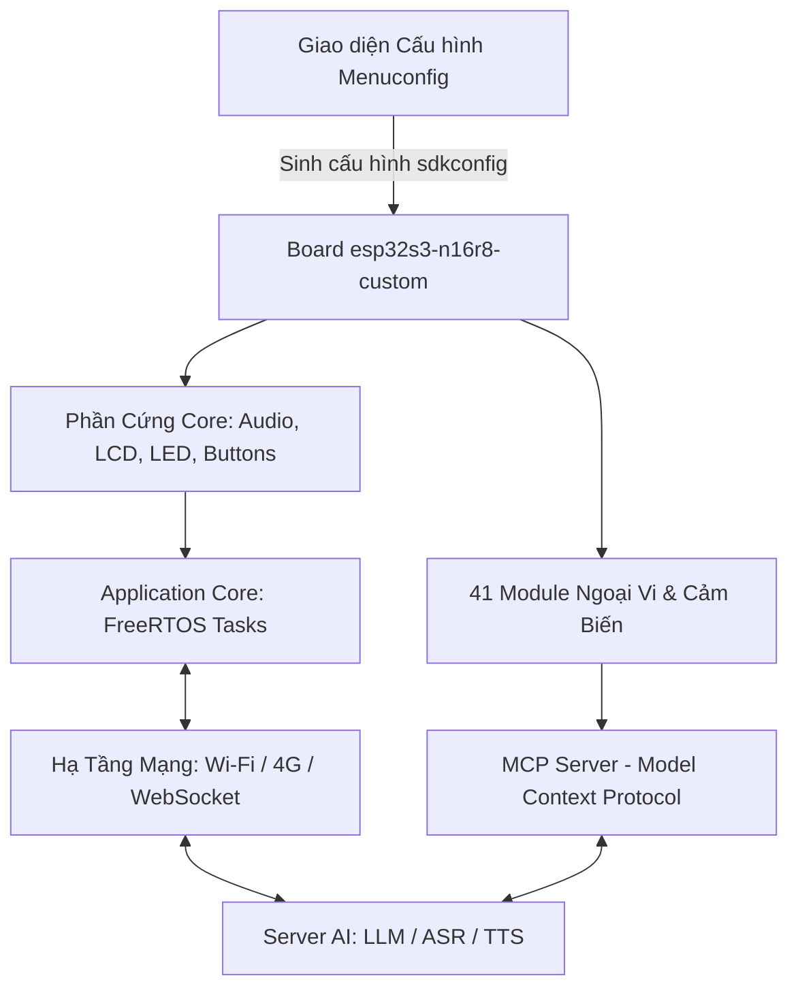
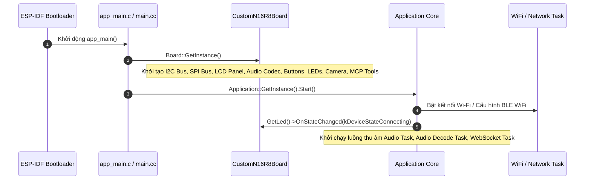

# 📖 TÀI LIỆU TOÀN DIỆN MÃ NGUỒN XIAOZHI (THÔNG TIN MÃ NGUỒN)

> 📌 **Tài liệu tham chiếu cấu trúc, sơ đồ file/thư mục, luồng vận hành và ý nghĩa từng thành phần trong dự án Xiaozhi Custom Hardware & Zero-Code Builder.**

---

## 📑 Mục Lục
1. [Tổng Quan Kiến Trúc Dự Án](#1-tổng-quan-kiến-trúc-dự-án)
2. [Sơ Đồ Cây Thư Mục & Bố Trí](#2-sơ-đồ-cây-thư-mục--bố-trí)
3. [Luồng Hoạt Động Cốt Lõi (Runtime Flow)](#3-luồng-hoạt-động-cốt-lõi-runtime-flow)
4. [Bảng Tra Cứu Ý Nghĩa Từng File & Thư Mục](#4-bảng-tra-cứu-ý-nghĩa-từng-file--thư-mục)
5. [Cơ Chế Bảo Vệ Phần Cứng & An Toàn Bộ Nhớ](#5-cơ-chế-bảo-vệ-phần-cứng--an-toàn-bộ-nhớ)
6. [Các Mục Đề Xuất Cần Thảo Luận Thêm](#6-các-mục-đề-xuất-cần-thảo-luận-thêm)

---

## 1. Tổng Quan Kiến Trúc Dự Án

Dự án Xiaozhi trong không gian làm việc này được xây dựng theo kiến trúc **Zero-Code Custom Builder**, dựa trên nền tảng **ESP-IDF v6.1** cho vi điều khiển **ESP32-S3 (N16R8: 16MB Flash + 8MB Octal PSRAM)**:



### Kiến trúc 2 Vùng Làm Việc (Two-Tier Workspace)
Dự án được phân chia thành 2 thư mục độc lập để tránh làm hỏng mã nguồn gốc:
1. **`config/` (Active Workspace):** Nơi **duy nhất** dùng để sửa code, chạy `idf.py menuconfig`, biên dịch `idf.py build`, nạp firmware và chạy unit tests.
2. **`Oginal/` (Clean Reference Mirror):** Bản sao lưu mã nguồn sạch. Chỉ đồng bộ từ `config/` sang `Oginal/` khi các bài kiểm thử đã vượt qua 100%.

---

## 2. Sơ Đồ Cây Thư Mục & Bố Trí

### 2.1. Cấu trúc thư mục gốc (Root Workspace)
```text
d:\Code\Antigravity\Xiaozhi/
├── 1_KiemTraThayDoi.bat         # Script kiểm tra sai khác giữa config/ và Oginal/
├── 2_DongBoMaNguon.bat          # Script đồng bộ an toàn từ config/ sang Oginal/
├── AGENTS.md / GEMINI.md        # Quy tắc làm việc và chỉ dẫn hệ thống cho AI Agent
├── README.md                    # Tài liệu giới thiệu dự án và hướng dẫn người dùng
├── ban_do_menuconfig.md         # Sơ đồ phả hệ toàn bộ 4 cấp menu Kconfig
├── danh_sach_ngoai_vi_va_giao_thuc.md # Bảng tra cứu 41 ngoại vi, IC, thanh ghi I2C
├── bang_chi_thi_prompt_mcp_ngoai_vi.md # Hướng dẫn System Prompt & ánh xạ hàm gọi MCP cho AI
├── xiaozhi_custom_project.md    # Đặc tả an toàn phần cứng và quy trình bảo vệ mã nguồn
├── thong_tin_ma_nguon.md        # (File này) Tài liệu giải phẫu chi tiết toàn bộ mã nguồn
│
├── config/                      # NƠI LÀM VIỆC CHÍNH CỦA DỰ ÁN (Active Target)
│   ├── CMakeLists.txt           # File build gốc của project ESP-IDF
│   ├── Kconfig                  # Điểm neo load menuconfig
│   ├── partitions.csv           # Bảng phân vùng Flash (Factory 3MB, NVS, Assets...)
│   ├── sdkconfig.defaults*      # Cấu hình mặc định cho các dòng chip (esp32s3, c3, p4...)
│   │
│   ├── main/                    # Mã nguồn C/C++ chính của ứng dụng
│   │   ├── CMakeLists.txt       # Định nghĩa target, include headers, auto-glob board sources
│   │   ├── Kconfig.projbuild    # Hệ thống Menuconfig tùy biến (Menu 1..4, 41 ngoại vi)
│   │   ├── app_main.c / main.cc # Hàm nhập main() khởi động hệ thống
│   │   ├── application.cc / .h  # Bộ điều phối trung tâm (State Machine, Audio, WebSocket)
│   │   ├── mcp_server.cc / .h   # Máy chủ giao thức MCP (AI gọi tool điều khiển phần cứng)
│   │   │
│   │   ├── assets/              # Quản lý tài nguyên nhị phân (Font chữ, Icon, Emoji)
│   │   ├── audio/               # Trình điều khiển Codec (ES8311, ES8388, Box, NoAudio)
│   │   ├── boards/              # Danh sách các bo mạch phần cứng được hỗ trợ
│   │   │   ├── common/          # Driver dùng chung (Camera, BusManager, Controllers...)
│   │   │   └── esp32s3-n16r8-custom/ # Bo mạch tùy biến chính cho N16R8
│   │   │
│   │   ├── display/             # Quản lý màn hình đồ họa LVGL (SPI LCD, OLED, MIPI)
│   │   ├── drivers/             # Trình quản lý ngoại vi cấp thấp (Audio, Display, Storage, Input)
│   │   ├── led/                 # Driver LED trạng thái (WS2812 Single/Strip, PWM GpioLed)
│   │   ├── notify/              # Hệ thống thông báo âm thanh / hiệu ứng
│   │   └── protocols/           # Giao tiếp mạng (WebSocket, MQTT, MCP Protocol)
│   │
│   └── scripts/                 # Công cụ đóng gói assets và kiểm thử tự động
│       ├── tests/               # 93 Unit Tests (test_gpio_validator, test_build...)
│       ├── build_default_assets.py
│       └── release.py
│
├── Oginal/                      # Bản sao lưu đối chiếu sạch
└── tools/                       # Bộ công cụ PowerShell kiểm tra và đồng bộ
```

---

## 3. Luồng Hoạt Động Cốt Lõi (Runtime Flow)

### 3.1. Luồng Khởi Động Phần Cứng (Bootstrapping Flow)


### 3.2. Vòng Đời Trạng Thái (Device State Machine)
Các trạng thái trong `device_state.h` điều khiển đồng bộ màn hình và LED:
- `kDeviceStateStarting`: Đang khởi động bo mạch. LED chạy hiệu ứng Cầu vồng xoay (`RainbowChase`).
- `kDeviceStateWifiConfiguring`: Chưa có Wi-Fi hoặc đang quét mạng. LED chớp xanh dương chậm.
- `kDeviceStateConnecting`: Đang bắt tay WebSocket với server AI. LED xanh sáng tĩnh.
- `kDeviceStateIdle`: Chế độ chờ rảnh. LED tắt hoặc mờ dần (`FadeOut`).
- `kDeviceStateListening`: Micro mở thu âm. LED chuyển đỏ (sáng mạnh khi phát hiện giọng nói).
- `kDeviceStateSpeaking`: Server AI phản hồi phát âm thanh qua Loa. LED chuyển hiệu ứng **Cầu vồng đổi màu nhanh (Fast Rainbow)**.
- `kDeviceStateFatalError`: Lỗi phần cứng/mạng nghiêm trọng. LED chớp đỏ nhanh cảnh báo.

### 3.3. Luồng Dữ Liệu Âm Thanh Hai Chiều (Duplex Audio Pipeline)
1. **Thu âm (Mic Input):** Micro I2S (INMP441 / Codec ADC) thu mẫu PCM 16kHz $\rightarrow$ Bộ đệm DMA $\rightarrow$ Task mã hóa Opus $\rightarrow$ Đóng gói frame gửi qua WebSocket.
2. **Phát âm (Speaker Output):** Nhận stream Opus từ server qua WebSocket $\rightarrow$ Task giải mã Opus $\rightarrow$ Bộ đệm Audio DAC $\rightarrow$ I2S Out (MAX98357A / ES8311) $\rightarrow$ Loa ngoài.

### 3.4. Luồng Màn Hình & Giao Diện Đồ Họa (LVGL 9 Engine)
1. **Khởi tạo:** SPI Host 3 được cấu hình với buffer DMA tối đa 40 dòng (tránh tràn DMA SRAM).
2. **Khởi tạo Panel:** Driver tương ứng (`ST7789`, `ST7796`, `ILI9486`, `GC9A01`, `SSD1306`...) gửi bảng mã lệnh init phần cứng $\rightarrow$ Gọi `esp_lcd_panel_set_gap()` để chỉnh tọa độ lệch.
3. **Hiển thị:** `esp_lvgl_port` đảm nhiệm render giao diện bong bóng chat, biểu cảm robot, sóng âm thoại và thanh thông báo trạng thái. Nếu không có màn hình, tự động hạ cấp về `NoDisplay` an toàn.

### 3.5. Luồng Tương Tác Trí Tuệ Nhân Tạo (MCP Server Tool Execution)
Khi người dùng ra lệnh bằng giọng nói (ví dụ: *"Bật đèn phòng khách"*, *"Nhiệt độ hiện tại bao nhiêu?"*):
1. Server AI phân tích ngôn ngữ tự nhiên và gửi bản tin JSON-RPC gọi tool MCP về ESP32 qua WebSocket.
2. `mcp_server.cc` tiếp nhận, phân tích tên tool:
   - `turn_on_lamp` / `turn_off_lamp`: Kích hoạt [lamp_controller.cc](file:///d:/Code/Antigravity/Xiaozhi/config/main/boards/common/lamp_controller.cc) đóng/ngắt Relay trên GPIO đã cấu hình.
   - `get_sensor_data`: Gọi [sensor_controller.cc](file:///d:/Code/Antigravity/Xiaozhi/config/main/boards/common/sensor_controller.cc) đọc giá trị I2C từ AHT20/SHT30/BMP280/SCD40.
   - `control_actuator`: Gọi [actuator_controller.cc](file:///d:/Code/Antigravity/Xiaozhi/config/main/boards/common/actuator_controller.cc) điều khiển góc Servo hoặc tốc độ motor cầu H TB6612.
3. Kết quả thực thi được đóng gói JSON gửi ngược lại server AI để phát âm thanh xác nhận tới người dùng.

---

## 4. Bảng Tra Cứu Ý Nghĩa Từng File & Thư Mục

### 4.1. Thư mục cấu hình cấp cao & Bản dựng (`config/`)
| Tên File | Chức Năng & Ý Nghĩa Chi Tiết |
|---|---|
| `CMakeLists.txt` | File chỉ thị build cấp cao nhất của ESP-IDF, khai báo project `xiaozhi`. |
| `partitions.csv` | Sơ đồ phân vùng bộ nhớ Flash: Phân bổ `nvs`, `otadata`, `factory` (3MB cho binary), `assets` (chứa font/emoji). |
| `sdkconfig.defaults.esp32s3` | Các thiết lập Kconfig nền tảng cho chip ESP32-S3 (bật Octal PSRAM, Flash 80MHz, tối ưu compiler). |
| `idf_component.yml` | Khai báo các thư viện ESP Component Registry cần tải: `esp_lvgl_port`, `esp_lcd_touch`, `led_strip`, `cJSON`... |

### 4.2. Thư mục ứng dụng chính (`config/main/`)
| Tên File | Chức Năng & Ý Nghĩa Chi Tiết |
|---|---|
| `Kconfig.projbuild` | Trái tim của Zero-Code Builder: Định nghĩa toàn bộ menu cấu hình tiếng Việt từ Menu 1 đến Menu 4 cho 41 ngoại vi. |
| `main.cc` | Điểm bắt đầu của chương trình C++, gọi khởi tạo bo mạch và kích hoạt Application. |
| `application.cc` / `.h` | Bộ não điều khiển trung tâm: Quản lý vòng đời kết nối Wi-Fi, WebSocket, luồng âm thanh, chuyển đổi trạng thái bot. |
| `mcp_server.cc` / `.h` | Hiện thực máy chủ Model Context Protocol, đăng ký các hàm JSON schema cho server AI gọi tool. |
| `device_state.h` | Định nghĩa enum trạng thái hoạt động của bot (`Starting`, `Idle`, `Listening`, `Speaking`...). |
| `device_state_machine.cc` / `.h` | Quản lý chuyển dịch trạng thái mượt mà, phát sự kiện tới Màn hình và LED. |
| `assets.cc` / `.h` | Đọc dữ liệu tài nguyên đã đóng gói trong phân vùng `assets` (font chữ, icon). |
| `settings.cc` / `.h` | Quản lý việc đọc/ghi cấu hình người dùng vào bộ nhớ NVS (âm lượng, Wi-Fi SSID, giao diện). |
| `ota.cc` / `.h` | Hỗ trợ nâng cấp firmware từ xa qua mạng (Over-The-Air Update). |
| `gpio_validator.c` / `.h` | Thuật toán kiểm định an toàn phần cứng, ngăn chặn xung đột chân và chặn vùng cấm GPIO 26..37. |

### 4.3. Bo Mạch Tùy Biến (`config/main/boards/esp32s3-n16r8-custom/`)
| Tên File | Chức Năng & Ý Nghĩa Chi Tiết |
|---|---|
| `custom_n16r8_board.cc` | Hiện thực đầy đủ bo mạch tùy biến: Khởi tạo tất cả I2C, SPI, màn hình, bàn phím, camera, audio, MCP tools. |
| `config.h` | Ánh xạ toàn bộ macro từ `sdkconfig` sang hằng số GPIO vật lý kèm giá trị an toàn dự phòng. |
| `esp_lcd_ili9486.c` / `.h` | Driver chuyên dụng cho màn hình SPI LCD 3.5 inch ILI9486 / ILI9488 (320x480). |
| `esp_lcd_nv3030b.c` / `.h` | Driver chuyên dụng cho các dòng màn hình NewVision NV3023 / NV3030B giá rẻ. |
| `esp_lcd_jd9853.c` / `.h` | Driver chuyên dụng cho tấm nền vuông Jadard JD9853 / JD9365 (240x240). |

### 4.4. Trình Điều Khiển Màn Hình (`config/main/display/`)
| Tên File | Chức Năng & Ý Nghĩa Chi Tiết |
|---|---|
| `display.h` | Lớp trừu tượng cơ sở (Base Class) cho mọi loại màn hình. |
| `lcd_display.cc` / `.h` | Trình điều khiển màn hình màu (TFT SPI, RGB, MIPI DSI): Quản lý LVGL task, bố cục chat bong bóng, theme sáng/tối. |
| `oled_display.cc` / `.h` | Trình điều khiển màn hình đơn sắc OLED (SSD1306/SH1106 I2C): Tối ưu buffer 1-bit, bố cục nhỏ gọn 128x64/128x32. |
| `no_display.h` | Driver màn hình rỗng: Dùng khi bo mạch chạy ở chế độ Audio Only (không có màn hình), tránh crash. |

### 4.5. Trình Điều Khiển Đèn LED (`config/main/led/`)
| Tên File | Chức Năng & Ý Nghĩa Chi Tiết |
|---|---|
| `led.h` | Lớp cơ sở trừu tượng cho LED trạng thái. |
| `single_led.cc` / `.h` | Điều khiển 1 mắt LED RGB WS2812 bằng RMT: Hỗ trợ nhấp nháy đa màu và hiệu ứng Cầu vồng đổi màu nhanh. |
| `circular_strip.cc` / `.h` | Điều khiển dải / vòng tròn LED RGB: Hỗ trợ hiệu ứng Breathing, Scrolling Comet, Rainbow và RainbowChase xoay tròn. |
| `gpio_led.cc` / `.h` | Điều khiển đèn LED đơn sắc 1 chân bằng xung PWM (`ledc`), hỗ trợ thay đổi độ sáng và nhịp thở. |

### 4.6. Ngoại Vi & MCP Controllers Dùng Chung (`config/main/boards/common/`)
| Tên File | Chức Năng & Ý Nghĩa Chi Tiết |
|---|---|
| `bus_manager.c` / `.h` | Quản lý tập trung bus I2C và SPI, cho phép nhiều thiết bị chia sẻ cùng bus mà không chiếm quyền. |
| `lamp_controller.cc` / `.h` | Điều khiển bật/tắt Đèn / Rơ-le 220V qua lệnh giọng nói MCP. |
| `sensor_controller.cc` / `.h` | Đọc dữ liệu các cảm biến môi trường (nhiệt độ, độ ẩm, áp suất, CO2) cung cấp cho AI. |
| `actuator_controller.cc` / `.h`| Điều khiển động cơ Servo góc và động cơ DC cầu H cho robot thông minh. |
| `esp32_camera.cc` / `.h` | Thu nhận khung hình từ camera DVP/UVC gửi lên cloud để AI phân tích thị giác (Vision LLM). |
| `adc_battery_monitor.cc` / `.h`| Đọc điện áp pin Lithium qua ADC và tính toán phần trăm pin còn lại. |

---

## 5. Cơ Chế Bảo Vệ Phần Cứng & An Toàn Bộ Nhớ

1. **Hardware Shield cho N16R8:**
   - Bo mạch ESP32-S3-WROOM-1 N16R8 sử dụng giao tiếp Octal SPI tốc độ cao với các chân vật lý `GPIO 26 đến 37`.
   - Bất kỳ xung tín hiệu nào tác động vào dải chân này sẽ làm ngắt mạch nạp Flash hoặc hỏng dữ liệu trên PSRAM.
   - Toàn bộ Kconfig và `test_gpio_validator.py` thiết lập rào chắn **Hard-Gate**: Nếu phát hiện gán vào 26..37, hệ thống lập tức báo lỗi và chặn biên dịch.
2. **Cơ chế DMA Capable Buffer:**
   - Toàn bộ bộ đệm đồ họa dùng cho SPI DMA phải cấp phát bằng `heap_caps_malloc(..., MALLOC_CAP_DMA | MALLOC_CAP_INTERNAL)`.
   - Dung lượng truyền tải SPI (`max_transfer_sz`) được khống chế ở mức 40 dòng để không bao giờ vượt quá dung lượng SRAM nội bộ.
3. **Cơ chế Bắt Lỗi Mềm (Soft Fallback):**
   - Mọi thao tác kết nối ngoại vi (I2C, SPI, RMT) đều có kiểm tra mã lỗi `esp_err_t`.
   - Nếu một linh kiện không cắm hoặc bị đứt dây, driver tự động chuyển sang chế độ dự phòng an toàn (ví dụ: `NoDisplay`, `NoLed`) thay vì gọi lệnh `abort()` làm treo khởi động của ESP32.

---

## 6. Các Mục Đề Xuất Cần Thảo Luận Thêm

Theo chỉ đạo của bạn về việc **"cần thảo luận thêm"**, dưới đây là các chủ đề trọng tâm cần sự thống nhất để phát triển tiếp:

### 💬 Chủ đề 1: Bổ sung công cụ MCP Tool cho Ngoại Vi Mới
- Hiện tại MCP Tools đã hỗ trợ: `Lamp` (Rơ-le/Đèn), `Sensors` (Đọc cảm biến), `Actuator` (Servo/Motor DC), `Camera` (Chụp ảnh AI).
- **Cần thảo luận:** Bạn có muốn mở rộng thêm MCP tool chuyên biệt nào không?
  - *Ví dụ 1:* MCP điều khiển remote hồng ngoại (IR) bật/tắt máy lạnh, TV theo thương hiệu.
  - *Ví dụ 2:* MCP gửi tin nhắn SMS / gọi điện khẩn cấp qua modem 4G LTE ML307R.
  - *Ví dụ 3:* MCP quét thẻ NFC/RFID để phát kịch bản âm thanh riêng biệt.

### 💬 Chủ đề 2: Tối Ưu Hóa Giao Diện Màn Hình (UI Styles)
- Hiện tại mã nguồn hỗ trợ 2 kiểu giao diện: **Giao diện Bong bóng chat WeChat** (`CONFIG_USE_WECHAT_MESSAGE_STYLE`) và **Giao diện Biểu cảm Robot cổ điển** (Centered Emoji + Status Bar).
- **Cần thảo luận:** Bạn muốn ưu tiên phong cách giao diện nào làm mặc định cho các kích thước màn hình khác nhau (màn hình nhỏ 1.54" vs màn hình lớn 3.5" 320x480)?

### 💬 Chủ đề 3: Chiến Lược Quản Lý Bộ Nhớ Cho Camera & Vision
- Khi bật Camera OV2640/OV5640 cùng với màn hình độ phân giải cao (320x480), cả hai đều chiếm dụng một lượng lớn băng thông và bộ nhớ PSRAM.
- **Cần thảo luận:** Bạn muốn cố định độ phân giải chụp ảnh gửi AI là bao nhiêu (QVGA 320x240, VGA 640x480 hay HD) để cân bằng tốt nhất giữa tốc độ truyền mạng và độ chi tiết nhận diện của AI?

### 💬 Chủ đề 4: Tự Động Hóa Nạp & Đo Kiểm Phần Cứng
- Hiện đã có script kiểm tra GPIO và 93 Unit tests.
- **Cần thảo luận:** Bạn có muốn bổ sung thêm công cụ tự động quét bus I2C lúc khởi động (I2C Scanner) để in trực tiếp địa chỉ các cảm biến đang kết nối lên màn hình/Serial không?
